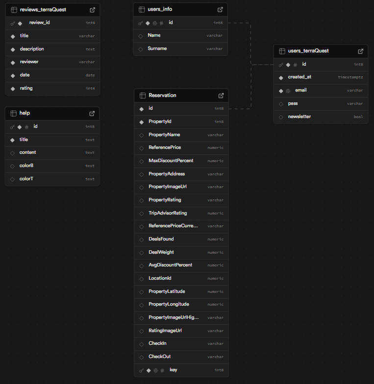

<div style="display: flex; align-items: center; gap: 10px;">
  
  <h1 style="color:gold; margin: 0;">TerraQuest</h1>
</div>

TerraQuest to platforma rezerwacyjna, która umożliwia użytkownikom łatwe wyszukiwanie, rezerwowanie oraz ocenianie obiektów noclegowych takich jak hotele, apartamenty, hostele i inne. Dzięki TerraQuest użytkownicy mogą szybko i wygodnie znaleźć idealne miejsce na wypoczynek, a także zarządzać swoimi rezerwacjami w jednym miejscu.

Nasza platforma oferuje intuicyjny interfejs, system oceny obiektów oraz filtry wyszukiwania, wszystko po to, aby ułatwić użytkownikom planowanie podróży i rezerwację noclegów.

---

# 🔧 Technologie

- **Frontend:** React.js, SCSS
- **Backend:** Node.js, Express.js
- **Testy:** Jest, React Testing Library, TypeScript, ts-jest, Supertest
- **Baza danych:** Supabase

---

# 🧑‍💻 Funkcjonalności

- ✅ **Rejestracja i logowanie użytkownika**  
  Użytkownicy mogą się zarejestrować, zalogować i zarządzać swoimi danymi.

- ✅ **Niezwykłe oferty promocyjne**  
  Użytkownicy mogą się otrzymać spersonalizowaną ofertę promocyjną, poprzez zapisanie się do Newslettera.

- ✅ **Wyszukiwanie dostępnych obiektów**  
  Użytkownicy mogą wyszukiwać dostępne hotele, apartamenty i inne obiekty według daty, lokalizacji, ceny i oceny.

- ✅ **Rezerwacja obiektów**  
  Użytkownicy mogą dokonywać rezerwacji obiektów na określony czas.

- ✅ **Zarządzanie rezerwacjami**  
  Użytkownicy mogą przeglądać lub anulować swoje rezerwacje.

- ✅ **Ocenianie i recenzowanie obiektów**  
  Po zakończeniu pobytu użytkownicy mogą oceniać obiekty oraz zostawiać opinie.

- ✅ **Filtrowanie obiektów po różnych kryteriach**  
  Możliwość filtrowania obiektów np. po cenie, ocenie, rodzaju zniżki.

- ✅ **Sortowanie obiektów po różnych kryteriach**  
  Możliwość przyjrzystego i łatwego sortowania obiektów np. po cenie malejącej, ocenie rosnącej, nowe oferty oraz najlepsze oferty.

- ✅ **Bezpieczne przechowywanie haseł (bcrypt)**  
  Hasła użytkowników są bezpiecznie przechowywane przy pomocy algorytmu `bcryptjs`.

- ✅ **Podstawowa administracja**  
  Administratorzy mogą zarządzać obiektami (dodawanie nowych, edytowanie, usuwanie).

---

# ⚙️ Instalacja
**📥 Krok 1 – Klonowanie repozytorium**
   ```bash
      git clone https://github.com/BergFilip/TerraQuest_web.git
   ```
**⬇️ Krok 2 – Przejście do projektu**
   ```bash
      cd TerraQuest
   ```
**⬇️ Krok 3 - Przejście do backendu**
  ```bash
    cd Backend
  ```
**📦 Krok 4 – Instalacja zależności**
   ```bash
      npm install
   ```
**▶️ Krok 5 – Uruchomienie Backendu**
   ```bash
      npm run dev
   ```
**⬇️ Krok 6 – Przejście do frontendu**
   ```bash
      cd ../Frontend
   ```
**📦 Krok 7 – Instalacja zależności**
   ```bash
      npm install
   ```
**▶️ Krok 8 – Uruchomienie Frontendu**
   ```bash
      npm run dev
   ```
**🌐 Po chwili aplikacja będzie dostępna pod adresem:**
   ```bash
      http://localhost:5173
   ```
---

# Podział pracy w projekcie TerraQuest

## Frontend:

### `src`

- **App.scss**: [Każdy]
- **App.tsx**: [Każdy]
- **index.scss**: [Każdy]
- **main.tsx**: [Każdy]

#### `sites`
- **About.tsx**: [Filip]
- **Contact.tsx**: [Filip]
- **Error.tsx**: [Filip]
- **Explore.tsx**: [Wiktor]
- **Help.tsx**: [Filip]
- **Home.tsx**: [Wiktor]
- **Login.tsx**: [Wiktor]
- **Newsletter.tsx**: [Filip]
- **Privacy_policy.tsx**: [Wiktor]
- **Product.tsx**: [Jacek]
- **Registration.tsx**: [Wiktor]
- **Search.tsx**: [Jacek]
- **User.tsx**: [Jacek]
- **Weather.tsx**: [Filip]

#### `styles`
- **About.scss**: [Filip]
- **Contact.scss**: [Filip]
- **Explore.scss**: [Wiktor]
- **Error.scss**: [Filip]
- **Help.scss**: [Filip]
- **Home.scss**: [Wiktor]
- **Login.scss**: [Wiktor]
- **Newsletter.scss**: [Filip]
- **Privacy_policy.scss**: [Wiktor]
- **Product.scss**: [Jacek]
- **Register.scss**: [Wiktor]
- **Search.scss**: [Jacek]
- **User.scss**: [Jacek]
- **Weather.scss**: [Filip]

---

## Backend:

- **auth.ts**: [Filip]
- **explore.ts**: [Wiktor]
- **newsletter.ts**: [Wiktor]
- **reviews.ts**: [Wiktor]
- **supabase.ts**: [Każdy]
- **reservation.ts**: [Filip]
- **userBookings.ts**: [Filip]
- **product.ts**: [Wiktor]
- **help1.ts**: [Jacek]
- **main.ts**: [Jacek]
- **supabaseClient.ts**: [Wiktor / Filip]

---

## Baza danych

- **Supabase** [Każdy] 
- **users_terraQuest** [Wiktor] 
- **reviews_terraQuest** [Wiktor] 
- **help** [Jacek] 
- **Reservation** [Filip] 
- **users_info** [Filip] <br><br>

# ZAKTUALIZOWAĆ SCHEMAT BAZY


---

## Testowanie

### Frontend
- **About.test.tsx**: [Filip]
- **Contact.test.tsx**: [Filip]
- **Error.test.tsx**: [Filip]
- **Explore.test.tsx**: [Wiktor]
- **Help.test.test.tsx**: [Filip]
- **Home.test.tsx**: [Wiktor]
- **Login.test.tsx**: [Wiktor]
- **Newsletter.ZROBIC.tsx**: [Filip]
- **Privacy_policy.test.tsx**: [Wiktor]
- **Product.test.tsx**: [Jacek]
- **Registration.test.tsx**: [Wiktor]
- **Search.test.tsx**: [Jacek]
- **User.test.tsx**: [Jacek]
- **Weather.test.tsx**: [Filip]

### Backend

- **auth.ts**: [Filip]
- **explore.ts**: [Wiktor]
- **newsletter.ts**: [Wiktor]
- **reviews.ts**: [Wiktor]
- **supabase.ts**: [Każdy]
- **reservation.ts**: [Filip]
- **userBookings.ts**: [Filip]
- **product.ts**: [Wiktor]
- **help1.ts**: [Jacek]
- **main.ts**: [Jacek]
- **supabaseClient.ts**: [Wiktor / Filip]

---

## Dokumentacja

- **Przygotowanie dokumentacji technicznej**: [Każdy]

---
  
  # 🌐 Opis podstron / backendu
  
  ## Frontend:
  
  ### 🧩 `App.tsx`
- **Opis**:  
  Główny komponent aplikacji React, odpowiedzialny za konfigurację routingu przy użyciu `react-router-dom`. Renderuje nagłówek (`Header`), stopkę (`Footer`) oraz zawartość główną opartą o aktualną ścieżkę URL.

---

## 📄 Lista podstron:

| Ścieżka                  | Komponent               | Opis                                                                 |
|--------------------------|-------------------------|----------------------------------------------------------------------|
| `/` / `/home`            | `Home.tsx`              | 🏠 Strona główna aplikacji                                           |
| `/privacypolicies`       | `Privacy_policy.tsx`    | 🔒 Polityka prywatności                                              |
| `/newsletter`            | `Newsletter.tsx`        | 📰 Zapis do newslettera                                              |
| `/about`                 | `About.tsx`             | ℹ️ Informacje o firmie/projekcie                                     |
| `/product/:hotelId`      | `Product.tsx`           | 🏨 Szczegóły konkretnego produktu (dynamiczne ID)                    |
| `/help`                  | `Help.tsx`              | ❓ Centrum pomocy / FAQ                                               |
| `/user`                  | `User.tsx`              | 👤 Panel użytkownika                                                 |
| `/contact`               | `Contact.tsx`           | 📬 Formularz kontaktowy                                              |
| `/login`                 | `Login.tsx`             | 🔐 Logowanie użytkownika                                             |
| `/register`              | `Registration.tsx`      | 📝 Rejestracja nowego użytkownika                                    |
| `/weather`               | `Weather.tsx`           | ☀️ Pogoda zintegrowana z zewnętrznym API                            |
| `/explore`               | `Explore.tsx`           | 🌍 Eksploracja dostępnych miejsc/ofert                               |
| `/search`                | `Search.tsx`            | 🔍 Wyszukiwanie zawartości                                           |
| `/error`                 | `Error.tsx`             | ⚠️ Wyświetlana w przypadku błędnej ścieżki                          |
| `*`                      | `Navigate -> /error`    | 🔁 Przekierowanie każdej innej ścieżki do strony błędu              |

---

## 🧱 Układ aplikacji

- **`<Header />`** – stały pasek nawigacji u góry
- **`<Footer />`** – globalna stopka aplikacji
- **`<Routes>`** – dynamiczna zawartość główna na podstawie adresu URL

---

### 🌐 `main.tsx`
- **Opis**:  
  Punkt wejściowy aplikacji. Renderuje aplikację do DOM.
- **Funkcje**:
  - Montowanie `<App />`
  - Konfiguracja `React.StrictMode`

---

### 📘 `About.tsx`
- **Opis**:  
  Strona informacyjna o projekcie lub firmie.
- **Zawiera**: tekst + ilustracje

---

### 📩 `Contact.tsx`
- **Opis**:  
  Formularz kontaktowy + dane kontaktowe
- **Funkcje**:
  - Walidacja formularza
  - Możliwość wysłania wiadomości

---

### 🚧 `Error.tsx`
- **Opis**:  
  Strona błędu 404 lub innego – wyświetlana gdy trasa nie istnieje
- **Funkcje**:
  - Przekierowanie do Home
  - Komunikat dla użytkownika

---

### 🔍 `Explore.tsx`
- **Opis**:  
  Strona eksploracji miejsc – propozycje podróży, ciekawe lokalizacje
- **Funkcje**:
  - Interaktywne kafelki
  - Dynamiczne generowanie treści

---

### ❓ `Help.tsx`
- **Opis**:  
  FAQ lub sekcja z pomocą dla użytkownika
- **Funkcje**:
  - Rozwijane pytania
  - Stylowanie UX-friendly

---

### 🏠 `Home.tsx`
- **Opis**:  
  Strona główna, landing page projektu
- **Zawiera**:
  - Banery
  - Sekcje promujące funkcje
  - Nawigacja do reszty podstron

---

### 🔐 `Login.tsx`
- **Opis**:  
  Formularz logowania
- **Funkcje**:
  - Walidacja danych
  - Obsługa błędów

---

### 📬 `Newsletter.tsx`
- **Opis**:  
  Subskrypcja newslettera
- **Funkcje**:
  - Walidacja e-mail
  - Obsługa potwierdzeń

---

### 🛡️ `Privacy_policy.tsx`
- **Opis**:  
  Polityka prywatności
- **Zawiera**:
  - Tekst statyczny
  - Linki do zewnętrznych dokumentów

---

### 📦 `Product.tsx`
- **Opis**:  
  Widok konkretnego produktu/oferty
- **Funkcje**:
  - Pobieranie danych z API
  - Wyświetlanie szczegółów

---

### 📝 `Registration.tsx`
- **Opis**:  
  Rejestracja nowego użytkownika
- **Funkcje**:
  - Walidacja formularza
  - Hashowanie hasła (back-end)

---

### 🔎 `Search.tsx`
- **Opis**:  
  Strona wyszukiwania miejsc/ofert
- **Funkcje**:
  - Filtry
  - Sortowanie
  - Integracja z back-endem

---

### 👤 `User.tsx`
- **Opis**:  
  Profil użytkownika
- **Funkcje**:
  - Edycja danych
  - Historia rezerwacji

---

### ☀️ `Weather.tsx`
- **Opis**:  
  Praca wtoku

---

## Backend:

# 🌐 Opis testów

## Frontend:

### 🧪 About.test.tsx – [Testy komponentu About]

**Opis:**  
Testy jednostkowe dla komponentu `About`. Sprawdzają poprawność renderowania treści, obecność kluczowych sekcji oraz integrację z komponentem `Button`.

**Funkcje:**
- Sprawdzenie poprawnego renderowania komponentu `About` bez błędów
- Weryfikacja obecności tekstów i nagłówków (`Nasza misja`, `O TerraQuest`, itd.)
- Testowanie tekstu misji i opisu TerraQuest
- Sprawdzenie poprawności renderowania sekcji statystyk i osi czasu
- Testowanie obecności i treści przycisków (mockowanie komponentu `Button`)
- Walidacja obecności klas CSS w drzewie DOM

**Zależności:**
- `@testing-library/react` – renderowanie komponentów i selektory
- `jest` – mockowanie komponentów
- `../sites/About.tsx` – testowany komponent
- `../components/Button.tsx` – mockowany komponent przycisku

---

### 🧪 Contact.test.tsx – [Testy komponentu Contact]

**Opis:**  
Zestaw testów jednostkowych dla komponentu `Contact`. Testy skupiają się na poprawnym renderowaniu, strukturze DOM oraz integracji z komponentem `ContactForm`.

**Funkcje:**
- Sprawdzenie czy komponent `Contact` renderuje się bez błędów
- Weryfikacja obecności głównych klas strukturalnych (`.contact_site`, `.background`)
- Testowanie poprawnego wyrenderowania mockowanego komponentu `ContactForm`
- Upewnienie się, że do `ContactForm` nie są przekazywane żadne propsy

**Zależności:**
- `@testing-library/react` – renderowanie komponentów i selektory
- `jest` – mockowanie komponentów i sprawdzanie wywołań
- `../sites/Contact.tsx` – testowany komponent
- `../components/ContactForm.tsx` – mockowany komponent formularza kontaktowego

---

### 🧪 Error.test.tsx – [Testy komponentu Error]

**Opis:**  
Testy jednostkowe dla komponentu `Error`, który odpowiada za wyświetlenie komunikatu o błędzie 404 oraz przycisku powrotu na stronę główną.

**Funkcje:**
- Sprawdzenie, czy komponent renderuje komunikat o błędzie i przycisk
- Weryfikacja przekazywanych propsów do mockowanego komponentu `Button`
- Kontrola obecności odpowiednich klas CSS (`.error`, `.back`)
- Upewnienie się, że przycisk posiada poprawną trasę (`data-route="/"`) i etykietę (`Powrót`)

**Zależności:**
- `@testing-library/react` – renderowanie komponentu i selektory DOM
- `jest` – mockowanie komponentu `Button` i sprawdzanie wywołań
- `../sites/Error.tsx` – testowany komponent
- `../components/Button.tsx` – mockowany komponent przycisku

---

### 🧪 Help.test.tsx – [Testy komponentu Help]

**Opis:**  
Testy jednostkowe dla komponentu `Help`, odpowiadającego za interfejs pomocy i sekcję FAQ z możliwością wyszukiwania.

**Funkcje:**
- Renderowanie nagłówka, pola wyszukiwania oraz mockowanych komponentów `Button` i `FaqSection`
- Weryfikacja poprawnej struktury formularza wyszukiwania (input, ikona, form)
- Sprawdzenie przekazywanych propsów do komponentu `Button`
- Testowanie interakcji z polem wyszukiwania (zmiana wartości)

**Zależności:**
- `@testing-library/react` – renderowanie, selektory DOM, symulacja zdarzeń
- `jest` – mockowanie `Button` i `FaqSection`
- `../sites/Help.tsx` – testowany komponent
- `../components/help_section.tsx` – mockowany komponent FAQ
- `../components/Button.tsx` – mockowany komponent przycisku

---

### 🧪 Newsletter.ZROBIC.tsx – [Testy komponentu Newsletter]

**Opis:**  
Zestaw testów jednostkowych dla komponentu `Newsletter`, który umożliwia zapis do newslettera i wyświetla alert potwierdzający.

**Zakres testów:**
- Renderowanie podstawowej struktury strony z nagłówkiem, tekstem, polem e-mail i przyciskiem
- Kliknięcie przycisku uruchamia alert (przez `setShowAlert`)
- Sprawdzenie przekazywanych propsów do komponentu `Alert` (tytuł, wiadomość, callback `onClose`)
- Sprawdzenie działania `onClose` – zamyka alert (ustawia `showAlert` na `false`)

**Zależności:**
- `@testing-library/react` – renderowanie, selektory, obsługa zdarzeń
- `jest` – mockowanie `Alert` i `useState`
- `../sites/Newsletter.tsx` – testowany komponent
- `../components/Alert.tsx` – komponent alertu (mock)
- `react` – hook `useState` (mockowany)

**Mockowanie Reacta:**
- `useState` został zmockowany, by móc przechwycić wywołanie `setShowAlert` i przetestować jego działanie.

---

### 🌤️ Weather.test.tsx – [Testy komponentu Weather]

**Opis:**  
Zestaw testów jednostkowych dla komponentu `Weather`, który wyświetla komunikat o niedostępności oraz przycisk powrotu do strony głównej.

**Zakres testów:**
- Renderowanie tekstów informacyjnych o niedostępnej stronie
- Sprawdzenie obecności przycisku `Powrót` oraz jego atrybutów (`text`, `data-route`)
- Weryfikacja, czy `Button` otrzymuje poprawne propsy (`text: "Powrót", route: "/"`)

**Zależności:**
- `@testing-library/react` – renderowanie komponentu, selekcja elementów
- `jest` – mockowanie `Button`
- `../sites/Weather.tsx` – testowany komponent
- `../components/Button.tsx` – komponent przycisku (mock)

**Mockowanie Buttona:**
- Zamiast oryginalnego przycisku, renderowany jest prosty `<button data-testid="mock-button" />`, co ułatwia testowanie logiki przekazywania propsów bez zależności od implementacji wizualnej.

---

## Backend:

---